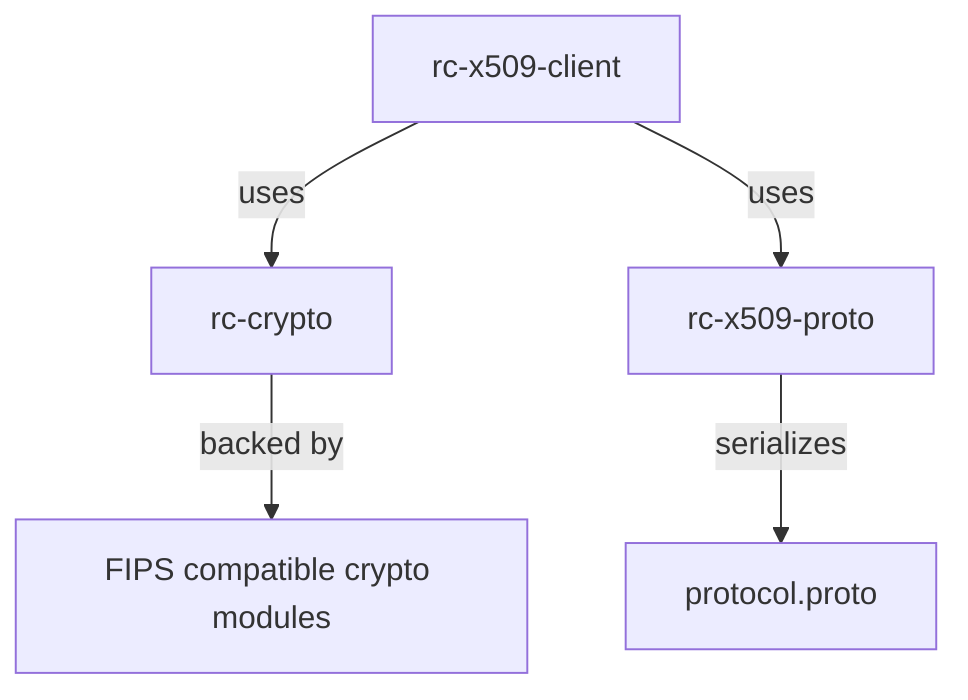

# libdd-rc

Open source components for [Remote Configuration] — a Rust library that provides cryptographic primitives and a Remote Config client for Datadog's x509 based delivery platform.

[Remote Configuration]: https://docs.datadoghq.com/remote_configuration/

---

## Crates

```text
libdd-rc/
├── lib/rc-crypto/          # Cryptographic primitives (ECDSA-P256, x509 certs)
├── lib/rc-x509-client/     # Remote Config client with FFI interface
└── lib/rc-x509-proto/      # Protobuf message definitions
```



---

## Architecture

`rc-x509-client` is designed to run inside a host language runtime (Go, Python, etc.) via FFI. It owns all protocol logic; the host runtime owns the actual network I/O.

```text
┌──────────────────────────────────────────┐
│            Host Runtime (Go / etc)       │
│                                          │
│  ┌────────────────┐  ┌────────────────┐  │
│  │  FFI Impl      │  │  FFI Impl      │  │
│  │  (RustToHost)  │  │  (HostToRust)  │  │
│  └───────▲────────┘  └────────┬───────┘  │
└──────────┼────────────────────┼──────────┘
           │  FFI boundary      │
┌──────────┼────────────────────┼──────────┐
│          │                    ▼          │
│     rc-x509-client (safe Rust)           │
│                                          │
│  ┌─────────────────────────────────┐     │
│  │  Ctx                            │     │
│  │  (client handle / entry point)  │     │
│  └──────────────────┬──────────────┘     │
└─────────────────────┼────────────────────┘
                      │  x509
                      │  (ClientToServer / ServerToClient)
                      │
┌─────────────────────▼────────────────────┐
│        Remote Config Backend             │
└──────────────────────────────────────────┘
```
 
→ FFI layer: [`lib/rc-x509-client/src/host_runtime/ffi/`](lib/rc-x509-client/src/host_runtime/ffi/)
→ Host/Rust trait boundary: [`lib/rc-x509-client/src/host_runtime/api.rs`](lib/rc-x509-client/src/host_runtime/api.rs)
→ C-compatible FFI surface (the FFI boundary above): [FFI API](#ffi-api)

---

## FFI API

The C-compatible FFI surface exposed to host runtimes:

```text
rc_init()                    → *mut Ctx       // create new client
rc_free(ctx)                                  // stop client & release all resources

rc_conn_new(ctx)             → *mut Conn      // create new client connection state
rc_conn_send_callback(conn, cb)               // register callback used by client
rc_conn_connected(conn)                       // mark connection as established
rc_conn_disconnected(conn)                    // mark connection as disconnected
rc_conn_free(conn)                            // release resources held by connection

rc_conn_recv(conn, data, len) → RecvRet       // passes data received for the connection
```

For use example: [`lib/rc-x509-client/src/host_runtime/ffi/README.md`](lib/rc-x509-client/src/host_runtime/ffi/README.md)

→ Connection state: [`lib/rc-x509-client/src/host_runtime/ffi/connection.rs`](lib/rc-x509-client/src/host_runtime/ffi/connection.rs)  
→ Client context: [`lib/rc-x509-client/src/host_runtime/ffi/ctx.rs`](lib/rc-x509-client/src/host_runtime/ffi/ctx.rs)

---

## I/O Flow

All network I/O is delegated to the host runtime. The library only processes bytes.

```text
Outgoing (client → server)              Incoming (server → client)

libdd-rc                                RC Backend Server
   │                                           │
   ▼                                           ▼
IOHandle::send()                         FFI Host Runtime
   │                                           │ rc_conn_recv()
   ▼                                           ▼
lib2ffi channel                          ffi2lib channel
   │                                           │
   ▼                                           ▼
I/O task calls SendCb                    IOHandle::recv()
   │                                           │
   ▼                                           ▼
FFI Host Runtime                         libdd-rc
   │
   ▼
RC Backend Server
```
→ [`include/libdd_rc.h`](include/libdd_rc.h)  

---

## Protocol Messages

Messages are defined in protobuf and flow between client and server.

```text
┌─────────────────┐  ClientToServer (via send_callback) ┌──────────────────┐
│  libdd-rc       │────────────────────────────────────►│  RC Backend      │
│  client         │                                     │  Server          │
│                 │◄────────────────────────────────────│                  │
└─────────────────┘  ServerToClient (via rc_conn_recv)  └──────────────────┘
```

All messages use `oneof` fields for backwards-compatiblility.

→ Proto schema: [`lib/rc-x509-proto/protos/protocol.proto`](lib/rc-x509-proto/protos/protocol.proto)

---

## Cryptography

`rc-crypto` wraps all crypto operations behind a simple API. This crate is for wrapping the crypto modules only - not for general code.

```
PrivateKey (ECDSA-P256)
    │
    ├── sign(data) → Signature          (ASN.1 DER, SHA-256)
    └── public_key() → PublicKey
            │
            └── verify(data, sig) → Result
                    │
                    └── key_id() → KeyId   (X509 Subject Key Identifier)

Certificate::from_pem(pem)
    ├── serial_number()
    ├── fingerprint()
    └── public_key() → PublicKey
```

All cryptography is backed by [aws-lc-rs](https://github.com/aws/aws-lc-rs) (FIPS-compatible).

→ Keys: [`lib/rc-crypto/src/keys/`](lib/rc-crypto/src/keys/)
→ Certificates: [`lib/rc-crypto/src/certificate/`](lib/rc-crypto/src/certificate/)
→ Signer trait: [`lib/rc-crypto/src/signer.rs`](lib/rc-crypto/src/signer.rs)

---

## Contributing

See [CONTRIBUTING.md](CONTRIBUTING.md) for commit signing requirements and dependency workflow.
