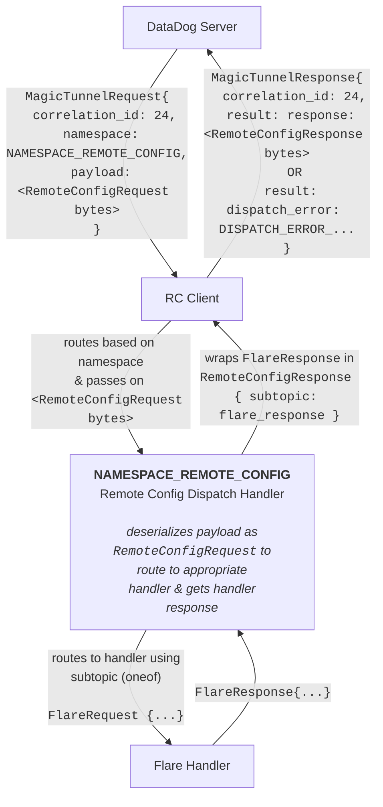

# Magic Tunnel Protocol

Check out the [`protocol.proto`] file for the core protocol types and
implementation suggestions.

The [`remote_config/`] directory shows an example integration, making use of
subtopics to enable future extensibility.

## Data Flow

This flow chart describes the data types and how they flow from the RC delivery
backend, to the ultimate integration handler that performs an action.

This describes the example use case of requesting an Agent debug "flare", an
action in the `REMOTE_CONFIG` namespace:

Integration teams implement and own the dispatch handler for their namespace,
and any subtopic handlers below it.
