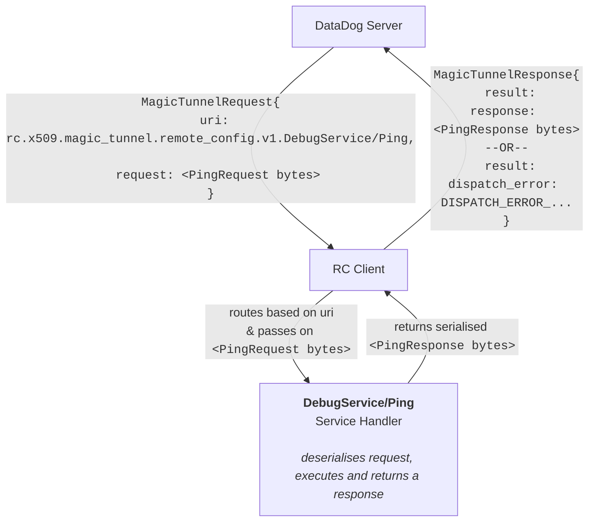

# Magic Tunnel Services

Here you'll find RPC service definitions for the messages that can be sent over
the Magic Tunnel.

The `remote_config/` directory shows an example integration for the Remote
Config team.

The `remote_queries/` directory holds the Remote Queries team's experimental
`v1alpha1` control service, `RemoteQueriesControlService`.

## Protocol

Internal protocol details! You can ignore this if you're just looking to use
Magic Tunnel.

Check out the `protocol.proto` file for the core protocol types and
implementation suggestions.

### Data Flow

This flow chart describes the data types and how they flow from the RC delivery
backend, to the ultimate integration handler that processes the request.

This shows the data flow when calling the `Ping` method on the Remote Config
`DebugService`:

```mermaid
graph TD
    %% Nodes
    DD[DataDog Server]
    RC[RC Client]

    DH["<b>DebugService/Ping</b><br/>Service Handler<br/><br/><i>deserialises request, executes and returns a response</i>"]


    %% Connections with Labels using <code> for monospacing
    DD -- "<code>MagicTunnelRequest{<br/>  uri: rc.x509.magic_tunnel.remote_config.v1.DebugService/Ping,<br/><br/>  request: &lt;PingRequest bytes&gt;<br/>}</code>" --> RC

    RC -- "<code>MagicTunnelResponse{<br/> result:<br />response: &lt;PingResponse bytes&gt;<br/>--OR--<br/>  result: dispatch_error: DISPATCH_ERROR_...<br/>}</code>" --> DD

    RC -- "routes based on uri<br/>& passes on <code>&lt;PingRequest bytes&gt;</code>" --> DH

    DH -- "returns serialised <code>&lt;PingResponse bytes&gt;</code>" --> RC


    %% Styling
    style DH text-align:center
    style RC padding:10px
```

Integration teams implement and own the service handler for each service they
define.
